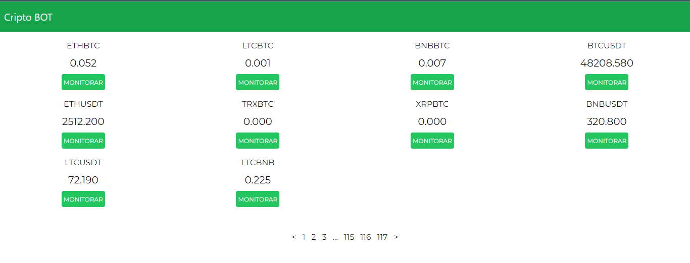
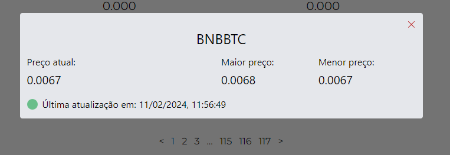

# Cripto BOT

## Descrição

Projeto de uma aplicação web que consome a API da Binance e consegue monitorar um criptoativo

## Projeto

## Tecnologias

- Frontend

  - React

  - Tailwind

  - React-Query

- Backend

  - Flask

  - Binance connector
